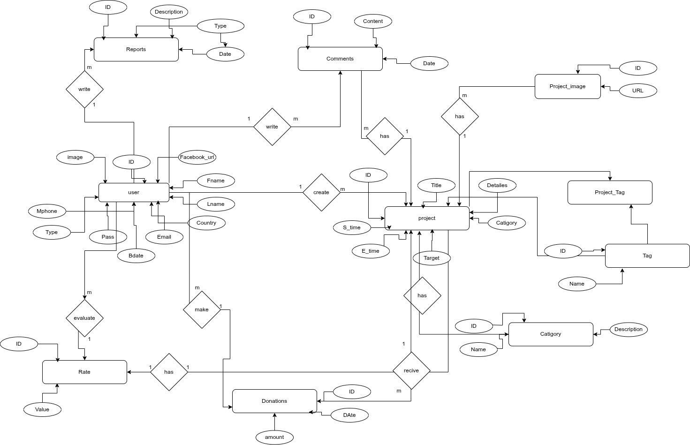

# Charity Crowdfunding Platform

This is a Django REST Framework-based web app for crowdfunding. It allows users in Egypt to create projects, accept donations, and manage fundraising campaigns.

---

## Tech Stack

* **Backend:** Django 5.2.1 + Django REST Framework
* **Database:** PostgreSQL
* **Auth:** JWT (SimpleJWT)
* **Async Email Activation and Forgot Password/Reset Password :** Celery + Redis
* **Docs:** Swagger 


---

## How to Set It Up

1. **Clone the project:**

```bash
git clone git@github.com:Abdhsrag/charity.git
cd charity
```

2. **Create a virtual environment and install requirements:**

```bash
python -m venv env
source env/bin/activate
pip install -r requirements.txt
```

3. **Set up PostgreSQL:**

* Create a database named `charity_db`
* Make sure your DB settings in `settings.py` match

4. **Apply migrations and create a superuser:**

```bash
python manage.py migrate
python manage.py createsuperuser
```

5. **Run Redis and Celery:**

```bash
redis-server
celery -A charity worker --loglevel=info
```

### What Redis & Celery Do

* **Redis** is used as a message broker.
* **Celery** handles background tasks like sending email activation links or processing long-running tasks asynchronously.

These tools help improve performance and user experience by offloading time-consuming operations.

6. **Start the Django server:**

```bash
python manage.py runserver
```


---
## ER-Diagram, Mapping, and Postman Collection

---

### 📊 Database Design

- [📄 mapping.pdf](./ERD-Mapping-Postman.Collection/mapping.pdf): Table/database design

---

### 🖼 ER Diagram

Visual Entity Relationship Diagram:  


---

### 🧩 Draw.io File

Edit or view the ER diagram using Draw.io:  
[Open D_porject_ERD.drawio](./ERD-Mapping-Postman.Collection/D_porject_ERD.drawio) with [Draw.io](https://app.diagrams.net)

---

### 🧪 API Testing

- [📬 Charity.postman_collection.json](./ERD-Mapping-Postman.Collection/Charity.postman_collection.json): Postman collection for testing all API endpoints

---

